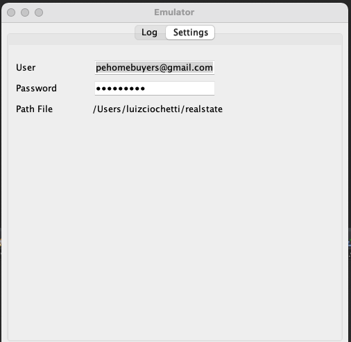
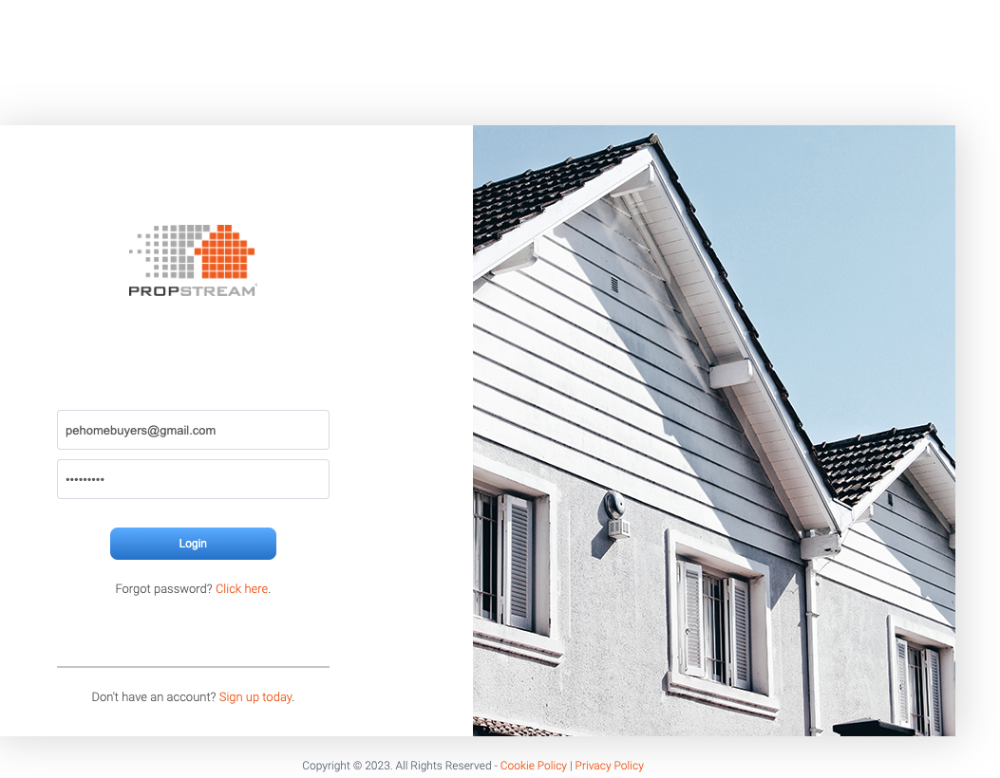
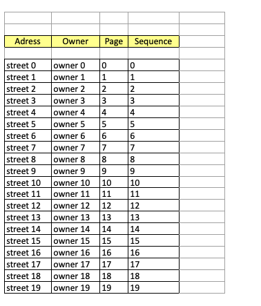

    Project Real state scrapping data 
    it is a Web scrapping data i build to get data about house to rent/sale this a project building with Java and Selenium to get data from webSite and putting the data in excel file
    <table>
    <tbody>
    <thead>
        <tr>
            <th align="center">
                 
                

                    <small>#</small>
                

            </th>
            <th align="center">
                 
                
 
                    <small>
                        NAME
                    </small>
                

            </th>
            <th align="center">
                
                
 
                    <small>
                    PREVIEW
                    </small>
                

            </th>
        </tr>
    </thead>
    <tbody>
        <tr>
            <td>01</td>
            <td><a href="01">settings screen</a></td>
            <td align="center">
            </td>
        </tr>
          <tr>
            <td>02</td>
            <td><a href="01">start scrapping</a></td>
            <td align="center">
            </td>
        </tr>
         <tr>
            <td>03</td>
            <td><a href="01">generate report on .xls file</a></td>
            <td align="center">
            </td>
        </tr>
       
  </tbody>
</table>

